

    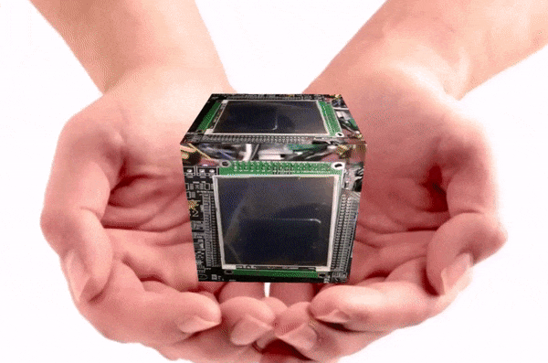

# GuiLite - The smallest GUI library
     
- [中文](README_zh.md)
- [✨Features](#features)
- [🚀Quick Launch](#quick-launch)
- [📚Documents](#documents)
- [📈How to Learn?](#how-to-learn)
- [📀Videos](#videos)
- [📞Community Channel](#community-channel)
***
## Introduction
GuiLite is the smallest GUI library with 5000 lines of code, could run on **all platforms**(e.g, iOS, Android, Linux, Windows, macOS, Docker and MCU without OS), and work with **many languages**(e.g. Swift, Java, Javascript, C#, Golang).
- ✂️Small: 5,000 lines of C++ code, could be merged into 1 header & 1 source file(GuiLite.h/GuiLite.cpp) - Easy to [build & port](doc/HowToBuild.md)
- ⚡Fast: Render GUI within one invoking, independent of any OS and any third party library -  Make GUI run quickly and smoothly
- 💉Inject: Run inside Qt/MFC/Winform/Cocoa/Web - Keep Qt/MFC code reusable, and speed it up by local GuiLite-optimization
- ⚙️️Hardware Minimum Requirment:

| Processor | Disk/ROM space | Memory |
| --- | --- | --- |
| 24 MHZ | 29 KB | 9 KB |

## 🔥New feature：3D engine - [Hello 3D](https://github.com/idea4good/GuiLiteSamples#hello-3d)
- 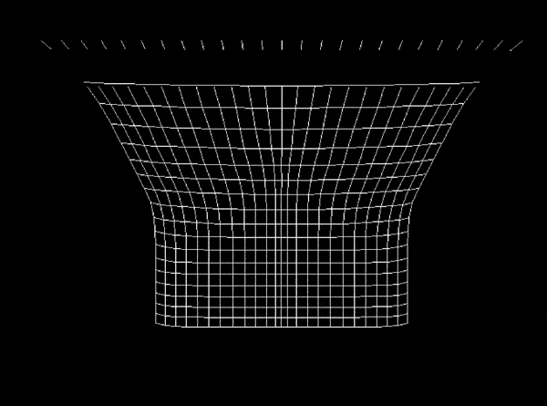
- Hardware requirment: 16K RAM, 36 MHZ
- Cross platform(e.g, Windows, Linux, MCU, Qt, MFC)
- Easy to build 3D object
- Could upgrade your UI experience

## ✨Features
### ⚔️Cross platform
| ARM Linux | STM32 Without OS |
| --- | --- |
| 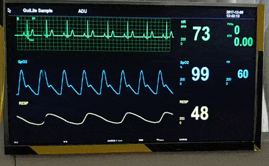 | 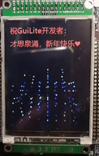 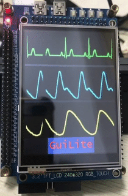 |

| Windows Mixed Reality | Android |
| --- | --- |
| 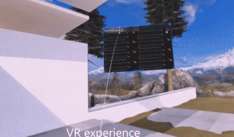 | 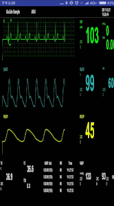 |

| macOS | iOS |
| --- | --- |
| 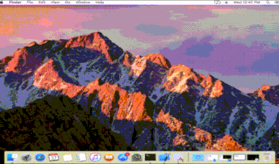 |  |
***
### 🔍GuiLite previewer(WYSIWYG extension for GuiLite)
[GuiLite Previewer](https://github.com/idea4good/GuiLitePreviewer) is a Visual Studio Code extension, could extract GUI information from C++ code and preview GUI at preview page(What you see is what you get)

***
### 😎Gorgeous UI
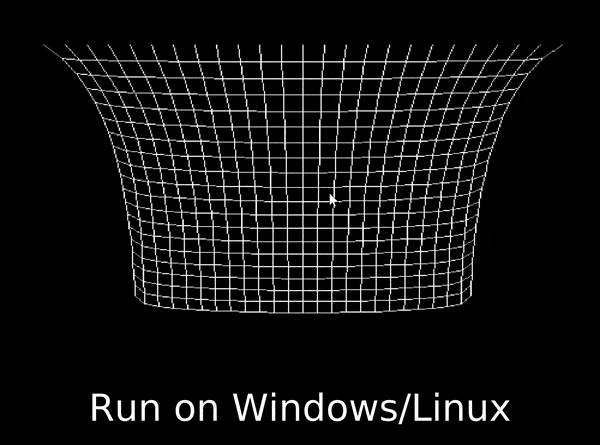
***
### 🔣Multi-language:
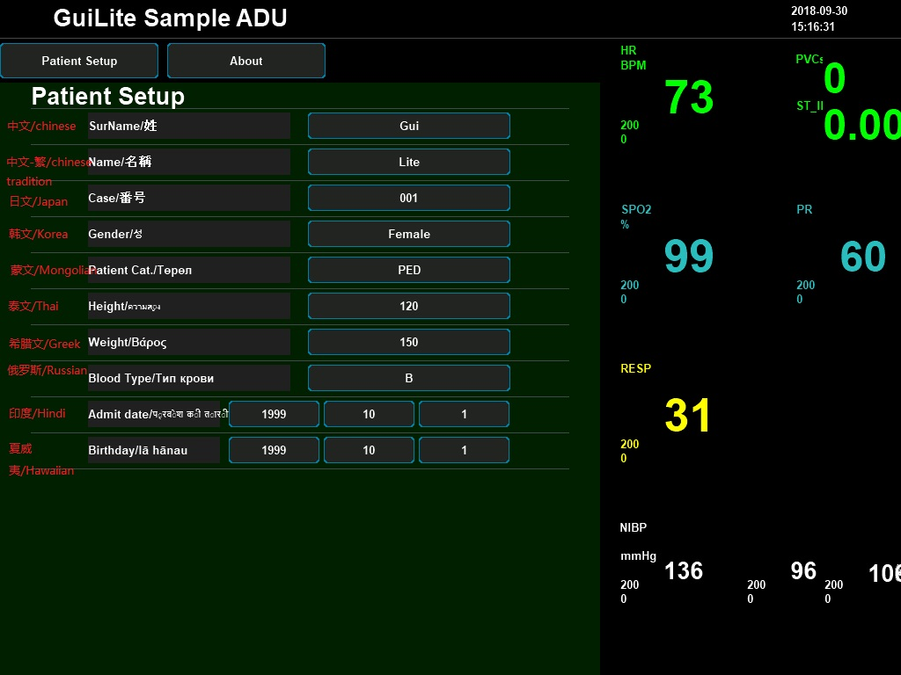
***
### 🌐IoT Solution & 📊Code Telemetry
- Report build activities to cloud: 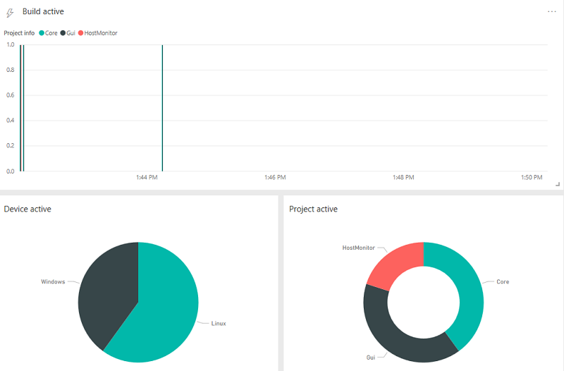
- Sync running data to cloud: 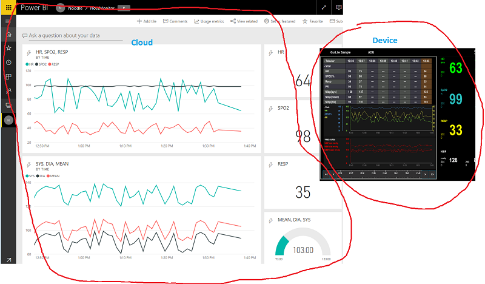
- ⚠️To stop telemetry, remove script files(e,g: sync_build.bat .sync.sh .sync_build.sh)
***
### 🐋Support Docker
We build GuiLite demo as docker image, you can update/deploy/run the latest GuiLite demo on your device with single command below:
- `sudo docker run -it --privileged -v /dev:/dev-share idea4good/gui-lite:latest bash /run.sh`
***
## 📦Package GuiLite Samples into 3D Web
- 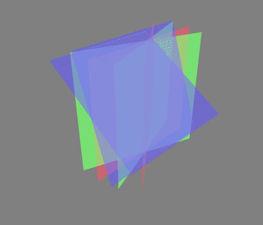
- Run GuiLite Samples[(HelloParticle, HelloWave)](https://github.com/idea4good/GuiLiteSamples) on Web and 3D scenario
- [Source code](https://github.com/idea4good/GuiLiteWeb/blob/master/CubeEx/main.js)
***
## 🚀Quick Launch
GuiLite is only a framework, could not create UI by itself. In order to show how to build UI App with it, We provide some samples for you.
- Sample code [here](https://github.com/idea4good/GuiLiteSamples).
- Sample introduction:

| Sample name | Platform | Description | Build guidance | Diffculty level |
| --- | --- | --- | --- | --- |
| HelloParticle | Windows, Linux, STM32F103, STM32F429 | Show how to develop particle effect | [Build](https://github.com/idea4good/GuiLiteSamples/blob/master/HelloParticle/README.md) | ★ |
| HelloStar | Windows, Linux, STM32F103, STM32F429 | Show how to develop star field effect | [Build](https://github.com/idea4good/GuiLiteSamples/blob/master/HelloStar/README.md) | ★ |
| Hello3D | Windows, Linux, STM32F103 | Lightweight(MCU level) 3D engine base on GuiLite | [Build](https://github.com/idea4good/GuiLiteSamples/blob/master/Hello3D/README.md) | ★★ |
| HelloNets | Windows, Linux, STM32F103 | Show how to build physics App with GuiLite | [Build](https://github.com/idea4good/GuiLiteSamples/blob/master/HelloNets/README.md) | ★★ |
| HelloGuiLite | Windows, Linux | Show how to Initialize UI, load resource, layout UI | [Build](https://github.com/idea4good/GuiLiteSamples/blob/master/HelloGuiLite/README.md) | ★★ |
| HelloWidgets | Windows, Linux | Show how to use GuiLite widgets | [Build](https://github.com/idea4good/GuiLiteSamples/blob/master/HelloWidgets/README.md) | ★★ |
| HelloMario | Windows, Linux, STM32F103, STM32F429 | Show how to develop multi-layer UI system | [Build](https://github.com/idea4good/GuiLiteSamples/blob/master/HelloMario/README.md) | ★★ |
| HelloNavigation | Windows, Linux, STM32F103, STM32F429 | Show how to navigate/click widgets by hard button in non-touch GUI scenario | [Build](https://github.com/idea4good/GuiLiteSamples/blob/master/HelloNavigation/README.md) | ★★|
| HelloFont | Windows, Linux | Show how to use multi-language feature(UTF-8) | [Build](https://github.com/idea4good/GuiLiteSamples/blob/master/HelloFont/README.md) | ★★ |
| HelloAnimation | Windows, Linux | Show how to make animation | [Build](https://github.com/idea4good/GuiLiteSamples/blob/master/HelloAnimation/README.md) | ★★ |
| HelloSlide | Windows, Linux | Show how to use sliding pages | [Build](https://github.com/idea4good/GuiLiteSamples/blob/master/HelloSlide/README.md) | ★★★ |
| HelloWave | Windows, Linux, STM32F103, STM32F429 | Show how to use wave widget | [Build](https://github.com/idea4good/GuiLiteSamples/blob/master/HelloWave/README.md) | ★★★ |
| HostMonitor | iOS, Mac, Android, Windows, Linux | Show how to build complex UI for all platforms | [Build](https://github.com/idea4good/GuiLiteSamples/blob/master/HostMonitor/README.md) | ★★★★ |

## 📚Documents
GuiLite is the smallest and simplest GUI library.
1. Just 5,000 line C++ code
2. Only use basic C++ feature(class, virtual function), no complex syntax
3. All rendering base on draw_pixel, no algorithm
4. Full documents and small live demos for reference
    - [Design specification](doc/HowToWork.md)
    - [How to build & port?](doc/HowToBuild.md)
    - [How to Layout widgets?](doc/HowLayoutWork.md)
    - [How to build unicode font/bitmap resource?](https://github.com/idea4good/GuiLiteToolkit)
    - [How to switch theme?](https://github.com/idea4good/GuiLiteSamples/blob/master/HostMonitor/UIcode/source/resource/resource.cpp)
    - [How to dispatch messages?](doc/HowMessageWork.md)
    - [UML chart of GuiLite core](doc/UML.md)
    - How GuiLite multi-layers work?
        - 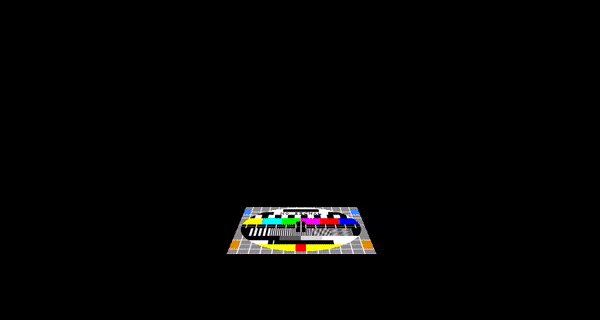
        - [Full video](https://www.youtube.com/watch?v=QzZJnU5KmDQ)
        - [Tutorial Source code](https://github.com/idea4good/GuiLiteWeb/blob/master/Graphic/main.js)

## 📈How to learn?
1. Build/Run GuiLite library
2. Build/Run HelloXXX demos
3. Read/Modify `HelloXXX/UIcode/UIcode.cpp` code
4. Read/Modify `gui` code
5. Read/Modify `core` code
6. Build your UI framework

## 📀Videos
- [GuiLite introduction](https://www.youtube.com/watch?v=grqXEz3bdC0)
- [3D GuiLite](https://v.youku.com/v_show/id_XMzYxNTE3MTI0MA)
- [GuiLite + STM32](https://v.youku.com/v_show/id_XNDAwNzM5MTM3Ng)

## Mirror repository
[Gitee in China](https://gitee.com/idea4good/GuiLite)

## 📞Community Channel
Thanks for the help from community, you guys make GuiLite better! And welcome new friend to join us.
- [**@Twitter**](https://twitter.com/idea4good)
- QQ code: 
