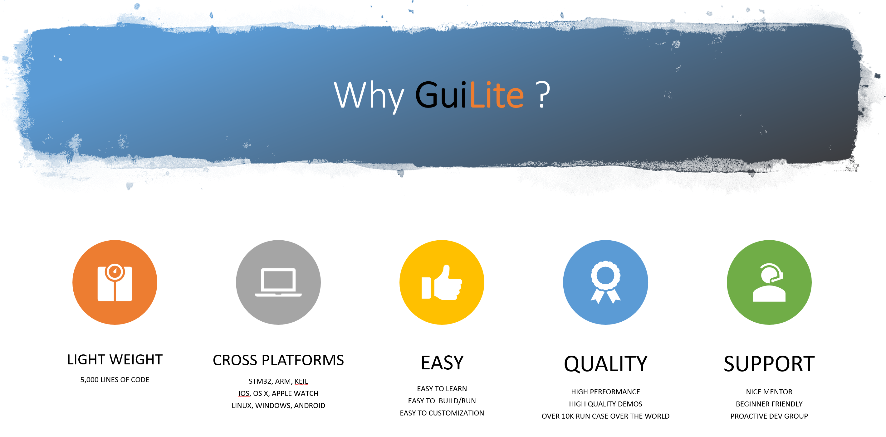

# Welcome to GUI-lite

    

  
  
  
  

The smallest header-only GUI library (4 KLOC) for all platforms.

    

- [中文](README_zh.md)

## Lightweight
- ✂️Small: 4,000+ lines of C++ code, zero dependency, header-only(GuiLite.h)
- ⚡Fast: High Rendering performance, even work on MCU
- 👫🏻Compatible: Work smoothly with 3rd party frameworks(Qt/MFC/Winform/Cocoa/Web)
- ⚙️️Hardware Minimum Requirements:

    | Processor | Disk/ROM space | Memory |
    | --- | --- | --- |
    | 24 MHZ | 29 KB | 9 KB |

## Cross platform
- Supported OSes: iOS/macOS/WatchOS, Android, Linux, Windows, RTOS... or **MCU without OS**
- Supported languages: C/C++, Swift, Java, Javascript, C#, Golang...
- Supported 3rd party libraries: Qt, MFC, Winforms, CoCoa...

## Hero features
- ☁️Cloud + IoT Solution: master your IoT business all over the world
- 🔣Multi-language, supports UTF-8;📀Playback Video
- 🔨[Toolkit](https://github.com/idea4good/GuiLiteToolkit) for building font/image resources
- 📐[Layout GUI WYSIWYG](https://github.com/idea4good/GuiLitePreviewer)
- 📊Code Telemetry and Analysis in real time(**remove .sh/.bat files if dislike to share**)
- 📦Supports 3D and [Web](https://github.com/idea4good/GuiLiteWeb)
- 🐋Run in docker with a single command: `sudo docker run -it --privileged -v /dev:/dev-share idea4good/gui-lite:latest bash /run.sh`

## Easy to learn and support
Even a C beginner could master GUI-lite quickly. The source code only uses basic C++ features (class, virtual function). We chose C++ as it could make the code size significantly smaller and easier to read.
- 📚Documentation
    - [How to use GUI-lite?](documents/HowToUse.md)
    - [Design specification](documents/HowToWork.md)
    - [How to Layout widgets?](documents/HowLayoutWork.md)
    - [How to build unicode font/bitmap resource?](https://github.com/idea4good/GuiLiteToolkit)
    - [How to switch theme?](https://github.com/idea4good/GuiLiteSamples/blob/master/HostMonitor/UIcode/source/resource/resource.cpp)
    - [How to dispatch messages?](documents/HowMessageWork.md)
    - [UML chart of GUI-lite core](documents/UML.md)
- 📈Learning steps
    1. Build GUI-lite library
    2. Build/Debug HelloXXX demos
    3. Read/Modify `HelloXXX/UIcode/UIcode.cpp` code
    4. Read/Modify `widgets` code
    5. Read/Modify `core` code
    6. Build your GUI framework
- 📞[Reach out us](#community-channel) if you have any questions you are welcomed to our developer family.
- 🀄️[Mirror repository in China](https://gitee.com/idea4good/GuiLite)

## Demo wall
- Zero dependency, 100% build pass & runnable
- Click the demo you like, and run it on your hardware
- Most of the demos have about 100 lines of UI code, code repository is [here.](https://github.com/idea4good/GuiLiteSamples)
---
### MCU platform
---
<table>
  <tr>
    <td align="center"><a href="https://github.com/idea4good/GuiLiteSamples/tree/master/Hello3D"> <b>3D on STM32</b></a>
    <td align="center"><a href="https://github.com/idea4good/GuiLiteSamples/tree/master/HelloWave"> <b>Wave on STM32</b></a>
    <td align="center"><a href="https://github.com/idea4good/GuiLiteSamples/tree/master/HelloParticle"> <b>Particle on STM32</b></a>
    <td align="center"><a href="https://github.com/idea4good/GuiLiteSamples/tree/master/HelloStar"> <b>Star on STM32</b></a>
  </tr>
  <tr>
    <td align="center"><a href="https://github.com/idea4good/GuiLiteSamples/tree/master/Hello3Dwave"> <b>3D wave on STM32</b></a>
    <td align="center"><a href="https://github.com/idea4good/GuiLiteSamples/tree/master/HelloNoTouch"> <b>Keyboard on STM32</b></a>
    <td align="center"><a href="https://github.com/idea4good/GuiLiteSamples/tree/master/HelloMario"> <b>Mario on STM32</b></a>
    <td align="center"><a href="https://github.com/idea4good/GuiLiteSamples/tree/master/HelloCircle"> <b>3D circle on STM32</b></a>
  </tr>
  <tr>
  <td align="center"><a href="https://github.com/idea4good/GuiLiteSamples/tree/master/Hello3Ddonut"> <b>3D donut on STM32</b></a>
  <td align="center"><a href="https://github.com/idea4good/GuiLiteSamples/tree/master/HelloTimer"> <b>Timer</b></a>
  <td align="center"><a href="https://github.com/idea4good/GuiLiteSamples/tree/master/HelloMolecule"> <b>Molecule move</b></a>
  <td align="center"><a href="https://github.com/idea4good/GuiLiteSamples/tree/master/HelloPendulum"> <b>Pendulum effect</b></a>
  </tr>
</table>

---
### IoT feature
---
<table>
  <tr>
    <td align="center"><a href="https://github.com/idea4good/GuiLiteSamples/tree/master/HostMonitor"> <b>Monitor IoT device on cloud</b></a>
    <td align="center"><a href="https://github.com/idea4good/GuiLiteSamples/tree/master/HostMonitor"> <b>Code Telemetry & Analysis in real time</b></a>
  </tr>
  <tr>
    <td align="center"><a href="https://github.com/idea4good/GuiLiteSamples/tree/master/HelloAzureIoT"> <b>Track IoT device over the world</b></a>
  </tr>
</table>

---
### Multi-language, Design tool and video
---
<table>
  <tr>
    <td align="center"><a href="https://github.com/idea4good/GuiLiteSamples/tree/master/HelloFont"> <b>Lattice Font</b></a>
    <td align="center"><a href="https://github.com/idea4good/GuiLiteSamples/tree/master/HelloFreetype"> <b>Freetype Font</b></a>
  </tr>
  <tr>
    <td align="center"><a href="https://github.com/idea4good/GuiLitePreviewer"> <b>Layout GUI</b></a>
    <td align="center"><a href="https://github.com/idea4good/GuiLiteSamples/tree/master/HelloJPG"> <b>Render JPG file quickly</b></a>
  </tr>
  <tr>
    <td align="center"><a href="https://github.com/idea4good/GuiLiteSamples/tree/master/HelloFFmpeg"> <b>Play video with FFmpeg</b></a>
  </tr>
</table>

---
### Widgets & Controller
---
<table>
  <tr>
    <td align="center"><a href="https://github.com/idea4good/GuiLiteSamples/tree/master/HelloGuiLite"> <b>Emulate  Windows UI</b></a>
    <td align="center"><a href="https://github.com/idea4good/GuiLiteSamples/tree/master/HelloScroll"> <b>Scroll widget</b></a>
  </tr>
  <tr>
    <td align="center"><a href="https://github.com/idea4good/GuiLiteSamples/tree/master/HelloWidgets"> <b>How to use widgets</b></a>
    <td align="center"><a href="https://github.com/idea4good/GuiLiteSamples/tree/master/HelloNets"> <b>3D Nets on Windows/Linux</b></a>
  </tr>
  <tr>
    <td align="center"><a href="https://github.com/idea4good/GuiLiteSamples/tree/master/HelloTransparent"> <b>Transparent dialog</b></a>
    <td align="center"><a href="https://github.com/idea4good/GuiLiteSamples/tree/master/HelloSlide"> <b>Swipe view</b></a>
  </tr>
</table>

---
### Cross platform
---
<table>
  <tr>
    <td align="center"><a href="https://github.com/idea4good/GuiLiteSamples/tree/master/HostMonitor"> <b>HostMonitor on Windows</b></a>
    <td align="center"><a href="https://github.com/idea4good/GuiLiteSamples/tree/master/HostMonitor"> <b>HostMonitor on Mac</b></a>
    <td align="center"><a href="https://github.com/idea4good/GuiLiteSamples/tree/master/HostMonitor"> <b>HostMonitor on Android</b></a>
  </tr>
  <tr>
    <td align="center"><a href="https://github.com/idea4good/GuiLiteSamples/tree/master/HostMonitor"> <b>HostMonitor on Windows Mixed Reality</b></a>
    <td align="center"><a href="https://github.com/idea4good/GuiLiteSamples/tree/master/HostMonitor"> <b>HostMonitor on Linux</b></a>
    <td align="center"><a href="https://github.com/idea4good/GuiLiteWeb"> <b>3D on Web</b></a>
  </tr>
  <tr>
    <td align="center"><a href="https://github.com/idea4good/GuiLiteWeb"> <b>3D on Web</b></a>
    <td align="center"><a href="https://github.com/idea4good/GuiLiteSamples/tree/master/HostMonitor"> <b>HostMonitor on iPhone</b></a>
    <td align="center"><a href="https://github.com/idea4good/GuiLiteWeb"> <b>How display work</b></a>
  </tr>
</table>

---
### Apple platform
---
<table>
  <tr>
    <td align="center"><a href="https://github.com/idea4good/GuiLiteSamples/tree/master/Hello3D"> <b>3D on Apple Watch</b></a>
    <td align="center"><a href="https://github.com/idea4good/GuiLiteSamples/tree/master/HelloWave"> <b>Wave on Apple Watch</b></a>    
    <td align="center"><a href="https://github.com/idea4good/GuiLiteSamples/tree/master/HelloParticle"> <b>Particle on iPhone</b></a>
  </tr>
</table>

## 📞Community Channel
Thanks for the help from the community, you all make GUI-lite better! And welcome to any new friend to join us.
- [**@Twitter**](https://twitter.com/idea4good)
- QQ group code:
<table>
  <tr>
    <td align="center"><a href="https://jq.qq.com/?_wv=1027&k=O714kulz"> <b>開發群🔑：616696441</b></a>
    <td align="center"> <b>公众号🔑：阿布编程</b>
  </tr>
</table>
