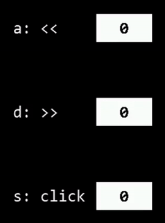

# GuiLite - The smallest UI framework
     
- [中文](doc/README-cn.md)
- [Features](#Features)
- [Start with Demo](#Start-with-Demo)
- [Documents](#Documents)
- [How to Learn?](#How-to-Learn)
- [Videos](#Videos)
- [Thanks](#Thanks)
***
## Introduction
- GuiLite is a barebone UI framework with 5000 lines of C++ code, it runs on **all platforms**(e.g, iOS, Android, Linux, Windows, macOS, Docker and **MCU with or without OS**).
- GuiLite is embeddable, it runs inside other UI frameworks(e.g, Qt, MFC, Winform, Cocoa). You could use GuiLite features and host UI features simultaneously.
- GuiLite render UI by itself, independent of OS & Grphic library.
- GuiLite could work with many languages(e.g. Swift, Java, C#, Golang).
- 🔧We want people to customize GuiLite.
- ⚙️We hope GuiLite is small enough to help you understand how UI works.
- 👑You should be the master of your UI and not be tied to a specific framework.

## 🔥New feature：Support non-touch GUI

- Hello Navigation has only [100+ lines code](https://github.com/idea4good/GuiLiteSamples/blob/master/HelloNavigation/UIcode/UIcode.cpp), showing you how to navigate/click widgets by hard button.
- Support: MCU / Windows / Linux

## Features
### Cross platform
| ARM Linux | STM32 Without OS |
| --- | --- |
|  |   |

| Windows Mixed Reality | Android |
| --- | --- |
|  |  |

| macOS | iOS |
| --- | --- |
|  |  |
***
### Support Docker Container
We build GuiLite demo as docker image, you can update/deploy/run the latest GuiLite demo on your device with single command below:
- `sudo docker run -it --privileged -v /dev:/dev-share idea4good/gui-lite:latest bash /run.sh`
***
### Easy customization

***
### Multi-language:

***
### Multi-theme

***
### IoT Edge or Code Telemetry
⚠️Remove all shell/batch files if you do not want to share the data.
- Report build activities to cloud: 
- Sync running data to cloud: 
***
## Start with Demo
GuiLite is only a framework, could not create UI by itself. In order to show how to build UI App with it, We provide some samples for you.
- Sample code [here](https://github.com/idea4good/GuiLiteSamples).
- Sample introduction:

| Sample name | Platform | Description | Build guidance | Diffculty level |
| --- | --- | --- | --- | --- |
| HelloParticle | Windows, Linux, STM32F103, STM32F429 | Show how to develop particle system | [Build](https://github.com/idea4good/GuiLiteSamples/blob/master/HelloParticle/README.md) | ★ |
| HelloGuiLite | Windows, Linux | Show how to Initialize UI, load resource, layout UI | [Build](https://github.com/idea4good/GuiLiteSamples/blob/master/HelloGuiLite/README.md) | ★★ |
| HelloMario | Windows, Linux, STM32F103, STM32F429 | Show how to develop multi-layer UI system | [Build](https://github.com/idea4good/GuiLiteSamples/blob/master/HelloMario/README.md) | ★★ |
| HelloNavigation | Windows, Linux, STM32F103, STM32F429 | Show how to navigate/click widgets by hard button in non-touch GUI scenario | [Build](https://github.com/idea4good/GuiLiteSamples/blob/master/HelloNavigation/README.md) | ★★|
| HelloFont | Windows, Linux | Show how to use multi-language feature(UTF-8) | [Build](https://github.com/idea4good/GuiLiteSamples/blob/master/HelloFont/README.md) | ★★ |
| HelloAnimation | Windows, Linux | Show how to make animation | [Build](https://github.com/idea4good/GuiLiteSamples/blob/master/HelloAnimation/README.md) | ★★ |
| HelloSlide | Windows, Linux | Show how to use sliding pages | [Build](https://github.com/idea4good/GuiLiteSamples/blob/master/HelloSlide/README.md) | ★★★ |
| HelloWave | Windows, Linux, STM32F103, STM32F429 | Show how to use wave widget | [Build](https://github.com/idea4good/GuiLiteSamples/blob/master/HelloWave/README.md) | ★★★ |
| HostMonitor | iOS, Mac, Android, Windows, Linux | Show how to build complex UI for all platforms | [Build](https://github.com/idea4good/GuiLiteSamples/blob/master/HostMonitor/README.md) | ★★★★ |

## Documents
- [How to build?](doc/HowToBuild.md)
- [How GuiLite work?](doc/CodeWalkthrough.md)
- [How to Layout widgets?](doc/HowLayoutWork.md)
- [How to build unicode font/bitmap resource?](https://github.com/idea4good/GuiLiteToolkit)
- [How to switch theme?](https://github.com/idea4good/GuiLiteSamples/blob/master/HostMonitor/UIcode/source/resource/resource.cpp)
- [How to dispatch messages?](doc/HowMessageWork.md)
- [UML chart of GuiLite core](doc/UML.md)

## How to learn?
1. Build/Run GuiLite library
2. Build/Run HelloXXX demos
3. Read/Modify `HelloXXX/UIcode/UIcode.cpp` code
4. Read/Modify `gui` code
5. Read/Modify `core` code
6. Build your UI framework

## Videos
- [GuiLite introduction](https://www.youtube.com/watch?v=grqXEz3bdC0)
- [3D GuiLite](https://v.youku.com/v_show/id_XMzYxNTE3MTI0MA)
- [GuiLite + STM32](https://v.youku.com/v_show/id_XNDAwNzM5MTM3Ng)

## Mirror repository
[Gitee in China](https://gitee.com/idea4good/GuiLite)

## Thanks
- Thanks the help from QQ group, you guys make GuiLite better! And welcome new friend to join us. 
- Thanks the donations from [Gitee users](https://gitee.com/idea4good/GuiLite), every penny of donations will be used for needy children or family of China.
