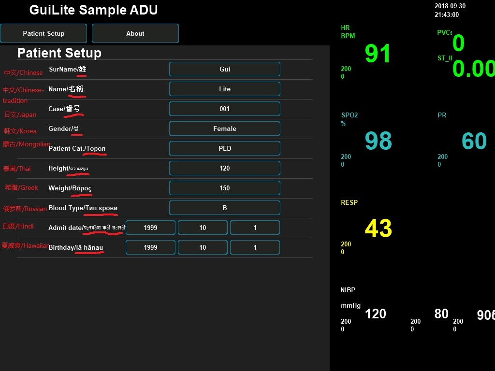
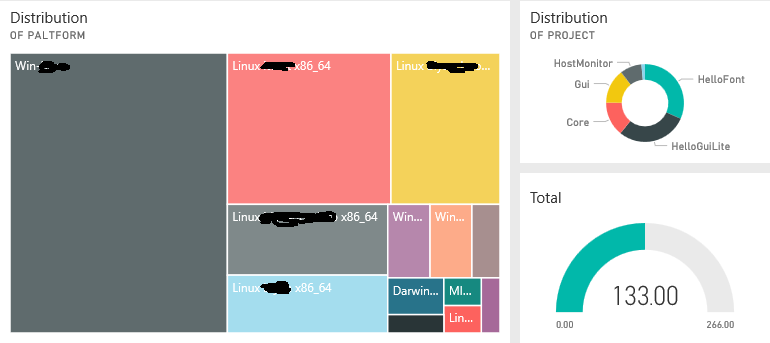

# GuiLite - The smallest UI framework
- [中文](doc/README-cn.md)
- [Features](#Features)
- [Demo](#Demo)
- [Documents](#Documents)
- [How to Learn?](#How-to-Learn)
- [Videos](#Videos)
- [Thanks](#Thanks)
***
## What is GuiLite?
- GuiLite has 5000 lines of C++ code, providing **UI framework for all platforms**, could run on iOS, Android, GNU/Linux, Windows, macOS and **all ARM Linux** IOT platforms.
- GuiLite is OS independent, even could run on any kind of **MCU without OS**.
- GuiLite is a embedded UI framework. It can work with Qt/MFC/UWP/XCode, which means you can get not only GuiLite features but also iOS/Android/macOS/Qt/MFC/UWP features as well.
- GuiLite can work with other languages(e.g. Swift, Java, C#).

- ⚠️We never encourage people accept GuiLite, but want people understand UI itself.
- ⚙️We hope GuiLite is small enough to help you understand how UI work, and build unique UI yourself.
- 👑You should be the king of your UI, not any UI library.

## New feature: Demo on MCU -- HelloWave + HelloParticle
&nbsp;&nbsp;&nbsp;&nbsp;&nbsp;&nbsp;&nbsp;&nbsp;
- MCU Hardware: STM32F103ZET6(512K ROM, 64K RAM) + 240*320 16bits color TFT LCD
- MCU Software: None OS + GuiLite
- **Hello Wave has only 100+ lines code!** [Check the code](https://github.com/idea4good/GuiLiteSamples/blob/master/HelloWave/UIcode/UIcode.cpp). Showing you how to use wave widget.
- **Hello Particle has only 100- lines code!** [Check the code](https://github.com/idea4good/GuiLiteSamples/blob/master/HelloParticle/UIcode/UIcode.cpp). Showing you how to develop particle system.
- [How to porting on any MCU in 5 minutes?](https://github.com/idea4good/GuiLiteSamples/blob/master/HelloWave/README.md#How-to-port-on-any-MCU-)
- Still support: Windows & Linux

## Features
### Cross platform
Ran on macOS & iOS:

 

Ran on Android & GNU/Linux embedded (ARM):

 

Ran on Windows Mixed Reality & MCU:

 

### Unicode & Bitmap
Wallpaper with bitmap:

Multi language:

[How to build unicode font/bitmap resource?](https://github.com/idea4good/GuiLiteToolkit)

### Multi theme

[How to switch theme?](https://github.com/idea4good/GuiLiteSamples/blob/master/HostMonitor/SampleCode/source/resource/resource.cpp)

### Self monitor
**Report build activities to cloud:**

**Sync local data to cloud:**

## Demo
GuiLite just a framework, it could not create UI by itself. In order to show how to build UI App with it, We provide some samples for your reference.
- Click [here](https://github.com/idea4good/GuiLiteSamples) to preview UI effect.
- Sample code discription:

| Sample name | Platform | Discription | Build code | level |
| --- | --- | --- | --- | --- |
| HelloGuiLite | Windows, Linux | Show how to Initilize UI, load resource, layout UI | [Build](https://github.com/idea4good/GuiLiteSamples/blob/master/HelloGuiLite/README.md) | Beginner |
| HelloFont | Windows, Linux | Show how to use muti languages(UTF-8) | [Build](https://github.com/idea4good/GuiLiteSamples/blob/master/HelloFont/README.md) | Beginner |
| HelloAnimation | Windows, Linux | Show how to make animation | [Build](https://github.com/idea4good/GuiLiteSamples/blob/master/HelloAnimation/README.md) | Beginner |
| HelloParticle | Windows, Linux, STM32F103, STM32F429 | Show how to develop particle system | [Build](https://github.com/idea4good/GuiLiteSamples/blob/master/HelloParticle/README.md) | Beginner |
| HelloSlide | Windows, Linux | Show how to use sliding pages | [Build](https://github.com/idea4good/GuiLiteSamples/blob/master/HelloSlide/README.md) | Intermediate |
| HelloWave | Windows, Linux, STM32F103, STM32F429 | Show how to use wave widget | [Build](https://github.com/idea4good/GuiLiteSamples/blob/master/HelloWave/README.md) | Intermediate |
| HostMonitor | iOS, Mac, Android, Windows, Linux | Show how to build complex UI for all platforms | [Build](https://github.com/idea4good/GuiLiteSamples/blob/master/HostMonitor/README.md) | Master |

## Documents
- [How to build?](doc/HowToBuild.md)
- [How GuiLite work?](doc/CodeWalkthrough.md)
- [UML chart](doc/UML.md)
- [How to layout widgets?](doc/HowLayoutWork.md)
- [How to dispatch messages?](doc/HowMessageWork.md)

## How to learn?
1. **Beginner** - Build/Run GuiLite library
2. **Beginner** - Build/Run HelloXXX demos
3. **Intermediate** - Read/Modify `HelloXXX/UIcode/UIcode.cpp` code
4. **Intermediate** - Read/Modify `gui` code
5. **Master** - Read/Modify `core` code
6. **Master** - Build your UI framework

## Videos
- [GuiLite introduction](https://www.youtube.com/watch?v=grqXEz3bdC0)
- [3D GuiLite](https://v.youku.com/v_show/id_XMzYxNTE3MTI0MA)
- [GuiLite + STM32](https://v.youku.com/v_show/id_XNDAwNzM5MTM3Ng)

## Gitee link
[Link to Gitee in China](https://gitee.com/idea4good/GuiLite)

## Thanks
### Thanks the help from QQ group, you guys make GuiLite better! and welcome new friend to join us.

### Thanks the donations from [Gitee users](https://gitee.com/idea4good/GuiLite), every penny of donations will be used for needy children or family of China.

