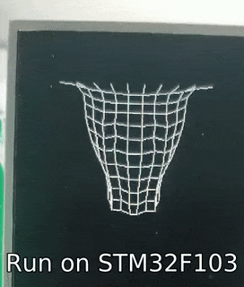

# 欢迎莅临 GuiLite

    

  
  
  
  

 大道至简 - 5千行/仅头文件/全平台GUI库 

    

## 轻-快-灵
- ✂️轻量: 5千行C++代码，单一头文件库：GuiLite.h
- ⚡超快: 一次调用就可以完成图形渲染，与操作系统及第三方库无关
- 💉灵活: 可注入在Qt/MFC/Winform/Cocoa/Web程序中运行 - 重用现有Qt/MFC代码
- ⚙️️最低硬件要求:

  | Processor | Disk/ROM space | Memory |
  | --- | --- | --- |
  | 24 MHZ | 29 KB | 9 KB |

## 跨平台
- 支持的操作系统：iOS/macOS/WathOS，Android，Linux（ARM/x86-64），Windows（包含VR），RTOS... 甚至**无操作系统的单片机**
- 支持的开发语言： C/C++, Swift, Java, Javascript, C#, Golang...
- 支持的第3方库：Qt, MFC, Winforms, CoCoa...

## 实用的功能
- 🔣支持多语言,采用 UTF-8 编码
- 🔨[资源制作工具](https://github.com/idea4good/GuiLiteToolkit)为你定制自己的字体/图片资源
- 📐[所见即所得的GUI布局工具](https://github.com/idea4good/GuiLitePreviewer)
- ☁️完美的“云” + “物联网”解决方案
- 📊编译活跃度统计，及实时分析
- 📦支持3D & [Web](https://github.com/idea4good/GuiLiteWeb)
- 🐋支持Docker，一条命令启动Docker: `sudo docker run -it --privileged -v /dev:/dev-share idea4good/gui-lite:latest bash /run.sh`

## 易学习和全面的技术支持
即使是C语言的初学者，也可以很快掌握GuiLite；代码只使用C++的基本特性（类和虚函数），选择C++语言，能让代码体积更小，更易阅读。
- 📚开发文档
    - [如何使用GuiLite?](documents/HowToUse.md)
    - [软件设计说明](documents/HowToWork-cn.md)
    - [如何布局UI?](documents/HowLayoutWork.md)
    - [如何制作多种文字/位图资源?](https://github.com/idea4good/GuiLiteToolkit)
    - [如何“换肤”？](https://github.com/idea4good/GuiLiteSamples/blob/master/HostMonitor/UIcode/source/resource/resource.cpp)
    - [如何传递消息?](documents/HowMessageWork.md)
    - [核心UML示意图](documents/UML.md)
- 📈学习方法
    1. **外围** - 成功编译GuiLite库
    2. **前戏** - 成功运行HelloXXX实例程序
    3. **交流** - 研读/修改100+行的`HelloXXX/UIcode/UIcode.cpp`源代码
    4. **深交** - 研读`gui`目录下的代码
    5. **攻核** - 研读`core`目录下的代码
    6. **分家** - 丰富，扩展自己的UI功能
- 📞遇到任何问题，都可以[联系我们](#社区交流)，也欢迎加入我们的开发者大家庭
- 🌐[GitHub链接](https://github.com/idea4good/GuiLite)

## Demo展示墙
点击你喜欢的实例，并运行在你的硬件上面
<table>
  <tr>
    <td align="center"><a href="https://github.com/idea4good/GuiLiteSamples/tree/master/Hello3D"> <b>3D on STM32</b></a>
    <td align="center"><a href="https://github.com/idea4good/GuiLiteSamples/tree/master/HelloWave"> <b>Wave on STM32</b></a>
    <td align="center"><a href="https://github.com/idea4good/GuiLiteSamples/tree/master/HelloParticle"> <b>Particle on STM32</b></a>
    <td align="center"><a href="https://github.com/idea4good/GuiLiteSamples/tree/master/HelloStar"> <b>Star on STM32</b></a>
  </tr>
  <tr>
    <td align="center"><a href="https://github.com/idea4good/GuiLiteSamples/tree/master/HelloNets"> <b>Nets on STM32</b></a>
    <td align="center"><a href="https://github.com/idea4good/GuiLiteSamples/tree/master/HelloNoTouch"> <b>Keyboard on STM32</b></a>
    <td align="center"><a href="https://github.com/idea4good/GuiLiteSamples/tree/master/HelloMario"> <b>Mario on STM32</b></a>
    <td align="center"><a href="https://github.com/idea4good/GuiLiteSamples/tree/master/HelloCircle"> <b>3D circle on STM32</b></a>
  </tr>
  <tr>
  <td align="center"><a href="https://github.com/idea4good/GuiLiteSamples/tree/master/HelloTimer"> <b>Timer</b></a>
  <td align="center"><a href="https://github.com/idea4good/GuiLiteSamples/tree/master/HelloMolecule"> <b>Molecule move</b></a>
  <td align="center"><a href="https://github.com/idea4good/GuiLiteSamples/tree/master/HelloSlide"> <b>Swipe view</b></a>
  <td align="center"><a href="https://github.com/idea4good/GuiLiteSamples/tree/master/HelloAnimation"> <b>Animation</b></a>
  </tr>
  <tr>
    <td align="center"><a href="https://github.com/idea4good/GuiLiteSamples/tree/master/Hello3D"> <b>3D on Apple Watch</b></a>
    <td align="center"><a href="https://github.com/idea4good/GuiLiteSamples/tree/master/HelloWave"> <b>Wave on Apple Watch</b></a>
    <td align="center"><a href="https://github.com/idea4good/GuiLiteSamples/tree/master/HelloParticle"> <b>Particle on iPhone</b></a>
    <td align="center"><a href="https://github.com/idea4good/GuiLiteSamples/tree/master/HostMonitor"> <b>HostMonitor on iPhone</b></a>
  </tr>
</table>

<table>
  <tr>
    <td align="center"><a href="https://github.com/idea4good/GuiLitePreviewer"> <b>Layout GUI</b></a>
    <td align="center"><a href="https://github.com/idea4good/GuiLiteSamples/tree/master/HelloGuiLite"> <b>Run Windows on Linux</b></a>
  </tr>
  <tr>
    <td align="center"><a href="https://github.com/idea4good/GuiLiteSamples/tree/master/HelloFont"> <b>Multi-language</b></a>
    <td align="center"><a href="https://github.com/idea4good/GuiLiteSamples/tree/master/HostMonitor"> <b>Code Telemetry & Analysis in real time</b></a>
  </tr>
  <tr>
    <td align="center"><a href="https://github.com/idea4good/GuiLiteSamples/tree/master/HelloScroll"> <b>Scroll widget</b></a>
  </tr>
</table>

<table>
  <tr>
    <td align="center"><a href="https://github.com/idea4good/GuiLiteSamples/tree/master/HelloNets"> <b>3D Nets on Windows/Linux</b></a>
    <td align="center"><a href="https://github.com/idea4good/GuiLiteSamples/tree/master/HelloWidgets"> <b>How to use widgets</b></a>
    <td align="center"><a href="https://github.com/idea4good/GuiLiteSamples/tree/master/HostMonitor"> <b>Multi-language</b></a>
  </tr>
  <tr>
    <td align="center"><a href="https://github.com/idea4good/GuiLiteWeb"> <b>3D on Web</b></a>
    <td align="center"><a href="https://github.com/idea4good/GuiLiteWeb"> <b>3D on Web</b></a>
    <td align="center"><a href="https://github.com/idea4good/GuiLiteWeb"> <b>Tutorial on Web</b></a>
  </tr>
  <tr>
    <td align="center"><a href="https://github.com/idea4good/GuiLiteSamples/tree/master/HostMonitor"> <b>HostMonitor on Windows</b></a>
    <td align="center"><a href="https://github.com/idea4good/GuiLiteSamples/tree/master/HostMonitor"> <b>HostMonitor on IoT-Cloud</b></a>
    <td align="center"><a href="https://github.com/idea4good/GuiLiteSamples/tree/master/HostMonitor"> <b>HostMonitor on Android</b></a>
  </tr>
  <tr>
    <td align="center"><a href="https://github.com/idea4good/GuiLiteSamples/tree/master/HostMonitor"> <b>HostMonitor on Windows Mixed Reality</b></a>
    <td align="center"><a href="https://github.com/idea4good/GuiLiteSamples/tree/master/HostMonitor"> <b>HostMonitor on Mac</b></a>
    <td align="center"><a href="https://github.com/idea4good/GuiLiteSamples/tree/master/HostMonitor"> <b>HostMonitor on Linux</b></a>
  </tr>
</table>

## 📞社区交流
- 感谢开发者群的所有同学，是你们塑造了今天的GuiLite！也欢迎新的大神/小白加入我们。 
