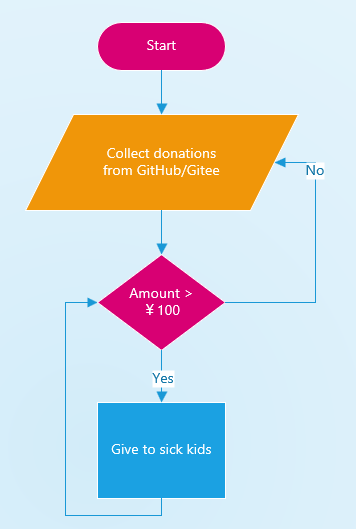

# Charity tracker
[中文](#大病儿童救助记录)
- We give to sick kids
- Each give was replied with "Donated from GuiLite Dev" for easy searching

## How to work

## Tracker list
| Date Given | Amount | Recipient Organization | Kid's name | Reason |
| --- | --- | --- | --- | --- |
| 2019-6-24 | ￥20 | China Charities Aid Foundation for Children | Yan Wang | [Blood cancer](https://yglian.qschou.com/gongyi/publicSite/detail?ChannelId=zhech&id=201905230000000050026157&mp=toutiao20190624) |
| 2019-6-25 | ￥20 | China Charities Aid Foundation for Children | Yixuan Wu | [Blood cancer](https://www.toutiao.com/a6706325979037434375/?timestamp=1561466239&app=news_article&group_id=6706325979037434375&req_id=201906252037190100180692204641D7D) |
| 2019-6-25 | ￥20 | China Charities Aid Foundation for Children | Chenchen| [Neuroblastoma](https://m.toutiaocdn.com/group/6706384216721998339/?app=news_article&timestamp=1561466189&req_id=2019062520362901001703913820265FD&group_id=6706384216721998339) |

# 大病儿童救助记录
- 我们救助“大病”儿童
- 每条救助下面都有回复：“GuiLite开发者捐助”,以便查询

## 救助流程

## 救助记录
| 救助日期 | 金额 | 收款机构 | 受助者姓名 | 受助原因 |
| --- | --- | --- | --- | --- |
| 2019-6-24 | ￥20 | 中华少年儿童慈善救助基金会 | 王研 | [血癌](https://yglian.qschou.com/gongyi/publicSite/detail?ChannelId=zhech&id=201905230000000050026157&mp=toutiao20190624) |
| 2019-6-25 | ￥20 | 中华少年儿童慈善救助基金会 | 吴奕轩 | [血癌](https://www.toutiao.com/a6706325979037434375/?timestamp=1561466239&app=news_article&group_id=6706325979037434375&req_id=201906252037190100180692204641D7D) |
| 2019-6-25 | ￥20 | 中华少年儿童慈善救助基金会 | 晨晨 | [神经母细胞瘤](https://m.toutiaocdn.com/group/6706384216721998339/?app=news_article&timestamp=1561466189&req_id=2019062520362901001703913820265FD&group_id=6706384216721998339) |