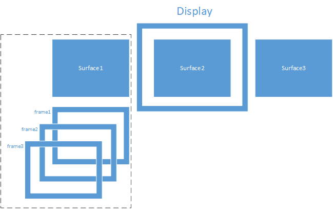

# 代码结构及注释
gui: 1）实现了各种常规控件（例如：按钮，标签，键盘）及容器（例如：视窗，对话框，滑动页面），开发者可以根据自己的需要，直接在相应的代码上进行修改或重绘，开发出有自己风格，特色的界面；2）实现了用户输入（例如：手指按下/释放）的消息传递，将用户的输入信息传递到整个UI体系树中，并调用相应的响应回调函数；开发者可以根据自己的需要添加/修改响应回调函数。

core: 实现了各个平台（例如：Windows, Linux）的封装，这些封装包括了基本的操作系统接口，底层绘制，图层管理和消息传递。由于开发者面对的应用场景有所不同，所需的操作系统接口也有区别，core中只提供了最基础的接口形式，开发者可以根据自己的需要，直接在api.h/api.cpp中添加新的操作系统接口或**单片机接口**。

最后，代码的更新/发布，不会作具体通知，请开发者随时更新代码库。

## GuiLite的基本原理
GuiLite只作两个工作：界面元素管理和图形绘制。

## 界面元素管理
界面元素管理包括：对所有控件（button，spinbox, lable, keyboard），容器（dialog, view）管理；具体的管理方法是为所有的界面元素建造一棵树，利用这棵树实现对所有界面元素的遍历，查询，状态更改。

比如：当你按下一个dialog的button时，手指的位置信息（x，y）会被传入树的根部（root），然后从root开始寻找，哪个dialog被点中，dialog的哪个button被点中，并调用buton被点中的回调函数，用于作相应处理（一般会进行button的状态修改及重绘工作）

### 界面元素如何创建
所有界面元素都继承自c_wnd类的对象，对象被实例化时，也就完成了界面元素的创建；但此时的界面元素是孤独的，与其他界面元素没有形成联系（没有父母，没有兄弟姐妹）

### 界面元素如何被管理（纳入tree中）
新创建的界面元素纳入管理的过程，就是为其添加父母，兄弟姐妹的过程。使用的函数接口为connect();从此该界面元素会跟其他界面元素一样，纳入一棵树中，并随之响应用户可能的点击操作。

当需要删掉该界面元素时，使用disconnect()；从此该界面元素会断绝所有的父子关系，从树上摘下来，不再响应用户的触控操作；但对象本身不会被销毁。典型应用场景：软键盘的创建/退出。

## 图形绘制
图形绘制包括： 绘制方法和图层管理。其中点绘制是线/面/位图绘制的基础，若干个点的绘制，形成点面及位图；图层管理，则是管理多个界面元素的遮挡关系，系统默认支持3层遮挡关系，这3个层次可以为：视图背景层，对话框层，keyboard/spinbox控件层。

### 绘制方法
请参看文件bitmap.cpp和surface.cpp中的draw_xxx()函数。
为了发挥GPU的加速功能，也可以通过改写draw_xxx/fill_xxx函数，使用GPU特性，来提升绘制效率。
### 图层管理
GuiLite的所有图层，如下图所示：

display层：
该层对应了物理显存，display层决定了一个显示终端的最终显示效果；通常系统中至少有一个display层。

surface层：
该层属于display层的一个部分；它为左右滑动而存在，每一张滑动页面均对应了一个surface层；surface层决定了一个滑动页面的最终显示效果；通常1个display层会对应多个surface层。

frame层:
该层属于surface层的一个部分；它现实叠加界面元素而存在。

### 文件注释
| core 文件名称 | 代码简介 |
| --- | --- |
| bitmap.cpp | 绘制位图，支持16 bits和32 bits |
| cmd_target.cpp | 映射UI消息及用户自定义的消息 |
| display.cpp | 生成显示设备，设定surface的数目，一个surface对应一个滑动页面 |
| rect.cpp | UI元素的位置信息 |
| surface.cpp | 实现像素点的绘制，并对各个图层（layer）进行管理 |
| wave_buffer.cpp | 波形数据的缓冲管理 |
| wave_ctrl.cpp | 实现波形控件 |
| wnd.cpp | UI元素的基本类，定义所有的UI元素信息、绘制及管理办法 |
| word.cpp | 显示文字 |
| api_linux.cpp | Linux适配层 |
| api_win.cpp | Window适配层 |
| audio_linux.cpp | Linux audio适配层 |
| audio_win.cpp | Windows audio适配层 |
| msg_linux.cpp | Dispatch消息的Linux实现 |
| msg_win.cpp | Dispatch消息的Windows实现 |

| gui 文件名称 | 代码简介 |
| --- | --- |
| button.cpp | 按钮控件的绘制及用户点击响应函数 |
| dialog.cpp | 对话框的绘制及管理方法 |
| edit.cpp | Edit控件的绘制及用户点击响应函数 |
| gesture.cpp | 手势识别方法，包括：鼠标按下，弹起及滑动 |
| keyboard.cpp | 键盘控件的绘制及用户点击响应函数 |
| label.cpp | 标签控件的绘制 |
| list_box.cpp | List控件的绘制及用户点击响应函数 |
| shape_resource.cpp | 自定义的形状资源，主要用于：支持圆角控件的缩放 |
| slide_group.cpp | 滑动页面的显示及管理 |
| spinbox.cpp | Spinbox控件的绘制及用户点击响应函数 |
| table.cpp | Table控件的绘制 |

### 函数接口注释
| 函数名称 | display.cpp 函数接口注释 |
| --- | --- |
| c_display | c_display构造函数，初始化显示参数。输入：物理framebuffer指针，物理显示器宽度，物理显示器高度，surface宽度，surface高度，颜色深度，surface个数/滑动页面的个数 |
| create_surface | 创建surface/滑动页面。输入： 用户ID，图层的个数|
| merge_surface | 横向组合surface，多用于滑动surface。输入：待组合的surface源1，待组合的surface源2，surface源1的起始点x坐标，surface源2的起始点x坐标，surface源1的起始点y坐标，surface源2的起始点y坐标，横向组合的偏移距离；输出：可能改变当前显示内容 |
| get_frame_buffer | 获取该display的物理framebuffer指针 |
| snap_shot | 生成当前显示的快照，并输出到bmp文件 |
