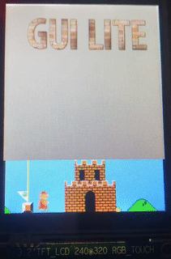
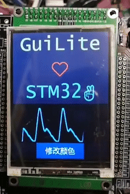
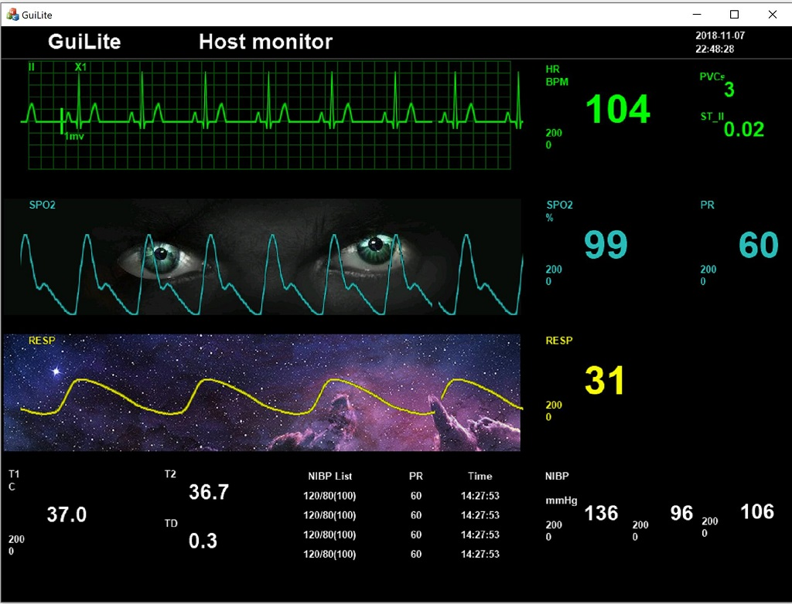
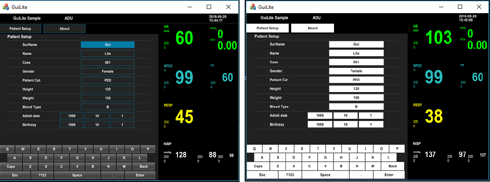
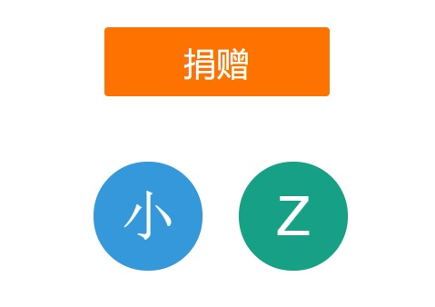

# GuiLite - 最小UI框架
- [功能介绍](#功能介绍)
- [实例程序](#实例程序)
- [开发文档](#开发文档)
- [学习方法](#学习方法)
- [视频链接](#视频链接)
- [致谢](#致谢)
***
## GuiLite是什么鬼？
- GuiLite（超轻量UI框架）是5千行代码的**全平台UI框架**，可以完美运行在iOS，Android，Windows（包含VR），Mac，和**市面所有的 ARM Linux物联网终端设备**上。
- GuiLite与操作系统及第三方图形库无关，甚至也可以运行在无OS的单片机环境。
- GuiLite可以嵌入在iOS、Android、MFC、QT等其他UI系统中，让你的界面集百家之长，又不失个性。
- GuiLite鼓励混合编程，开发者可以用GuiLite接管UI部分，用Swift，Java，Go，C#，Python开发业务部分。
- ⚠️不鼓励大家全盘接受GuiLite，更愿意大家掌握UI的核心原理
- ⚙️希望GuiLite小到足够帮助大家掌握UI工作原理，从而摆脱UI框架的束缚，构建自己独一无二的UI
- 👑任何UI框架都不为你我而生，你才是自己真正的主人

## 新功能：单片机系列 - “超级玛丽” -- HelloMario + HelloParticle + HelloWave
&nbsp;&nbsp;&nbsp;&nbsp;&nbsp;&nbsp;&nbsp;&nbsp;&nbsp;&nbsp;&nbsp;&nbsp;&nbsp;&nbsp;&nbsp;&nbsp;
- 单片机硬件配置：STM32F103ZET6(512K ROM，64K RAM) + 240*320 16位TFT屏
- 单片机软件配置：无操作系统 + GuiLite
- Hello Mario 仅有[100+行代码](https://github.com/idea4good/GuiLiteSamples/blob/master/HelloMario/UIcode/UIcode.cpp)，以“超级玛丽”为例，用于向开发者展示：如何使用GuiLite进行多图层的开发。
- Hello Particle 仅有[100-行代码](https://github.com/idea4good/GuiLiteSamples/blob/master/HelloParticle/UIcode/UIcode.cpp)，用于向开发者展示：如何使用GuiLite进行“粒子”效果的开发。
- Hello Wave 仅有[100+行代码](https://github.com/idea4good/GuiLiteSamples/blob/master/HelloWave/UIcode/UIcode.cpp)，用于向开发者展示：如何使用GuiLite进行“波形”效果的开发。
- [1分钟“无痛”移植到任意单片机平台？](https://github.com/idea4good/GuiLiteSamples/blob/master/HelloWave/README.md#How-to-port-on-any-MCU-)
- 这些实例亦可支持Windows和Linux平台

## 功能介绍
### 卓越的跨平台能力
在Mac, iOS下的运行效果:

 

在Android，嵌入式ARM Linux下的运行效果:

 

在Windows混合现实，及单片机下的运行效果:

 

### 万国语和墙纸
- 墙纸：

- 万国语(unicode)：

- [如何制作多种文字/位图资源?](https://github.com/idea4good/GuiLiteToolkit)

### “换肤”功能

[如何“换肤”？](https://github.com/idea4good/GuiLiteSamples/blob/master/HostMonitor/SampleCode/source/resource/resource.cpp)

### 自我监控
- **上报“编译/运行”情况至“云端”：**

- **同步“本地数据”至“云端”：**

## 实例程序
GuiLite只是一个框架，本身并不能生成UI。为了能够展示如何用GuiLite开发App，我们提供了一些实例程序给大家参考。
- 点击[这里](https://github.com/idea4good/GuiLiteSamples)预览UI效果。
- 实例程序的功能说明：

| 实例名称 | 支持的平台 | 功能简介 | 编译方法 | 难度 |
| --- | --- | --- | --- | --- |
| HelloParticle | Windows, Linux, STM32F103, STM32F429 | 粒子效果的应用 | [编译/运行](https://github.com/idea4good/GuiLiteSamples/blob/master/HelloParticle/README.md) | ★ |
| HelloGuiLite | Windows, Linux | 初始化GuiLite，加载资源，布局界面元素，按钮响应 | [编译/运行](https://github.com/idea4good/GuiLiteSamples/blob/master/HelloGuiLite/README.md) | ★★ |
| HelloMario | Windows, Linux, STM32F103, STM32F429 | 多图层的UI系统 | [编译/运行](https://github.com/idea4good/GuiLiteSamples/blob/master/HelloMario/README.md) | ★★|
| HelloFont | Windows, Linux | 显示多种语言（不限：中、英文） | [编译/运行](https://github.com/idea4good/GuiLiteSamples/blob/master/HelloFont/README.md) | ★★ |
| HelloAnimation | Windows, Linux | 动画的应用 | [编译/运行](https://github.com/idea4good/GuiLiteSamples/blob/master/HelloAnimation/README.md) | ★★ |
| HelloSlide | Windows, Linux | 滑屏界面的应用 | [编译/运行](https://github.com/idea4good/GuiLiteSamples/blob/master/HelloSlide/README.md) | ★★★ |
| HelloWave | Windows, Linux, STM32F103, STM32F429 | 波形控件的应用，及单片机移植办法 | [编译/运行](https://github.com/idea4good/GuiLiteSamples/blob/master/HelloWave/README.md) | ★★★ |
| HostMonitor | iOS, Mac, Android, Windows, Linux | 创建复杂界面，扩展自定义控件，适配全平台 | [编译/运行](https://github.com/idea4good/GuiLiteSamples/blob/master/HostMonitor/README.md) | ★★★★ |

## 开发文档
- [如何编译?](HowToBuild.md)
- [设计原理](CodeWalkthrough-cn.md)
- [UML示意图](UML.md)
- [如何布局UI?](HowLayoutWork.md)
- [如何传递消息?](HowMessageWork.md)

## 学习方法
1. **外围** - 成功编译GuiLite库
2. **前戏** - 成功运行HelloXXX实例程序
3. **交流** - 研读/修改100+行的`HelloXXX/UIcode/UIcode.cpp`源代码
4. **深交** - 研读`gui`目录下的代码
5. **攻核** - 研读`core`目录下的代码
6. **分家** - 丰富，扩展自己的UI功能

## 视频链接:
- [GuiLite简介](https://v.youku.com/v_show/id_XMzA5NTMzMTYyOA)
- [3D GuiLite](https://v.youku.com/v_show/id_XMzYxNTE3MTI0MA)
- [GuiLite + 单片机](https://v.youku.com/v_show/id_XNDAwNzM5MTM3Ng)

## Gitee链接
[国内码云链接](https://gitee.com/idea4good/GuiLite)

## 致谢
### 感谢开发者群的所有同学，是你们塑造了今天的GuiLite！也欢迎新的大神/小白加入我们。

### 感谢来自[码云用户](https://gitee.com/idea4good/GuiLite)的捐赠，您的每一分钱都会用来帮助急需帮助的中国儿童或家庭。

