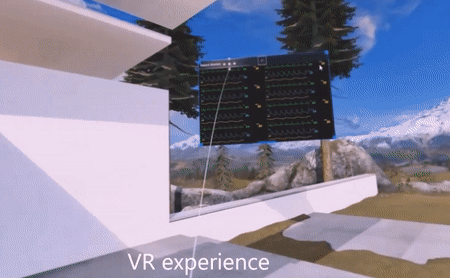

# GuiLite - 揭示UI原理，打造你自己的UI（框架） - 开发者qq群：527251257

超轻量UI框架 - GuiLite是由6千行左右的C/C++代码编写而成，它像MFC，QT一样为开发者提供界面支持。

- GuiLite可以完美运行在Android，Windows（包含VR），Mac，**单片机**和**市面所有的 ARM Linux物联网终端**设备上。
- GuiLite可以嵌入在MFC、QT、 Android等其他UI系统中。让你的界面集百家之长，又不失个性。
- GuiLite鼓励混合编程，开发者可以用C/C++编写的GuiLite接管UI部分，用Java，Go，C#，Python发开业务部分。

相比其他强大的UI框架，GuiLite只聚焦界面开发（特别是手机风格的滑动界面），只使用最基础的C++特性，直达绘制底层。希望通过减少代码，调用层次，让UI框架的体积最小，效率更高，使之流畅运行在：手机，电脑，单片机等硬件环境上。

注意：
GuiLite作为框架，本身并不产生界面，界面的集成效果，请参考:[GuiLiteSamples代码库](https://github.com/idea4good/GuiLiteSamples)、[GuiLiteSamples视频](http://v.youku.com/v_show/id_XMzA5NTMzMTYyOA)

## 为什么开发GuiLite？如何使用？
任何UI框架都不是为你我而生的，只有掌握核心原理，对其深度定制，才能真正掌握自己的命运！因此，我们开发了GuiLite，希望用这6千行代码揭示UI的核心原理和定制方法。

我们不推荐开发者全盘使用GuiLite；鼓励开发者在吃透代码后，根据自身业务特点，修改出更加丰富、个性的界面；或者发展出适合自己的UI框架。

为了聚焦UI核心原理，GuiLite会一直保持单片机的代码体量。

## 代码简介
gui: 1）实现了各种常规控件（例如：按钮，标签，键盘）及容器（例如：视窗，对话框，滑动页面），开发者可以根据自己的需要，直接在相应的代码上进行修改或重绘，开发出有自己风格，特色的界面；2）实现了用户输入（例如：手指按下/释放）的消息传递，将用户的输入信息传递到整个UI体系树中，并调用相应的响应回调函数；开发者可以根据自己的需要添加/修改响应回调函数。

core: 实现了各个平台（例如：Windows, Linux）的封装，这些封装包括了基本的操作系统接口，底层绘制，图层管理和消息传递。由于开发者面对的应用场景有所不同，所需的操作系统接口也有区别，core中只提供了最基础的接口形式，开发者可以根据自己的需要，直接在api.h/api.cpp中添加新的操作系统接口或**单片机接口**。

最后，代码的更新/发布，不会作具体通知，请开发者随时更新代码库。

## GuiLite的基本原理
GuiLite只作两个工作：界面元素管理和图形绘制。

## 界面元素管理
界面元素管理包括：对所有控件（button，spinbox, lable, keyboard），容器（dialog, view）管理；具体的管理方法是为所有的界面元素建造一棵树，利用这棵树实现对所有界面元素的遍历，查询，状态更改。

比如：当你按下一个dialog的button时，手指的位置信息（x，y）会被传入树的根部（root），然后从root开始寻找，哪个dialog被点中，dialog的哪个button被点中，并调用buton被点中的回调函数，用于作相应处理（一般会进行button的状态修改及重绘工作）

### 界面元素如何创建
所有界面元素都继承自c_wnd类的对象，对象被实例化时，也就完成了界面元素的创建；但此时的界面元素是孤独的，与其他界面元素没有形成联系（没有父母，没有兄弟姐妹）

### 界面元素如何被管理（纳入tree中）
新创建的界面元素纳入管理的过程，就是为其添加父母，兄弟姐妹的过程。使用的函数接口为connect();从此该界面元素会跟其他界面元素一样，纳入一棵树中，并随之响应用户可能的点击操作。

当需要删掉该界面元素时，使用disconnect()；从此该界面元素会断绝所有的父子关系，从树上摘下来，不再响应用户的触控操作；但对象本身不会被销毁。典型应用场景：软键盘的创建/退出。

## 图形绘制
图形绘制包括： 绘制方法和图层管理。其中点绘制是线/面/位图绘制的基础，若干个点的绘制，形成点面及位图；图层管理，则是管理多个界面元素的遮挡关系，系统默认支持3层遮挡关系，这3个层次可以为：视图背景层，对话框层，keyboard/spinbox控件层。

### 绘制方法
请参看文件bitmap.cpp和surface.cpp中的draw_xxx()函数。

### 图层管理
GuiLite的所有图层，如下图所示：

display层：
该层对应了物理显存，display层决定了一个显示终端的最终显示效果；通常系统中至少有一个display层。

surface层：
该层属于display层的一个部分；它为左右滑动而存在，每一张滑动页面均对应了一个surface层；surface层决定了一个滑动页面的最终显示效果；通常1个display层会对应多个surface层。

frame层:
该层属于surface层的一个部分；它现实叠加界面元素而存在，
