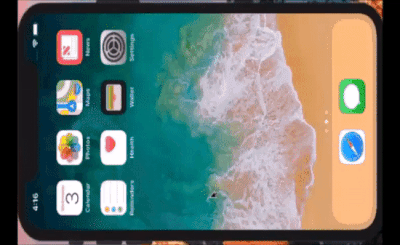

# GuiLite - 简洁出奇迹
在IOS，Mac下的运行效果:

 

在Android，嵌入式ARM Linux下的运行效果:

 

在Windows混合现实下的运行效果及开发者QQ群:

 

- GuiLite（超轻量UI框架）是6千行代码的**全平台UI框架**，可以完美运行在IOS，Android，Windows（包含VR），Mac，单片机*和市面所有的 ARM Linux物联网终端设备上。
- GuiLite可以嵌入在IOS、Android、MFC、QT等其他UI系统中，让你的界面集百家之长，又不失个性。
- GuiLite鼓励混合编程，开发者可以用GuiLite接管UI部分，用Swift，Java，Go，C#，Python发开业务部分。

相比QT、MFC，GuiLite不预设开发者的使用场景，不在具体功能上，大包大揽；用框架的简洁，换取开发的自由；GuiLite在图形绘制上面，力图一步到位，运行效率感人。

## 为什么开发GuiLite？如何使用？
任何UI框架都不是为你我而生的，只有掌握核心原理，对其深度定制，才能真正掌握自己的命运！因此，我们开发了GuiLite，希望用这6千行代码揭示UI的核心原理和定制方法。

我们不推荐开发者全盘使用GuiLite；鼓励开发者在吃透代码后，根据自身业务特点，修改出更加丰富、个性的界面；或者发展出适合自己的UI框架。

为了聚焦UI核心原理，GuiLite会一直保持单片机的代码体量。

## 快速上手
- 下载实例代码: `git clone https://github.com/idea4good/GuiLiteSamples.git`
- `cd GuiLiteSamples\HostMonitor`
- [编译/运行在任意平台上](https://github.com/idea4good/GuiLiteSamples/blob/master/HostMonitor/README.md)

## 开发文档
[代码走读](CodeWalkthough-cn.md)

[如何编译?](HowToBuild.md)

[如何布局UI?](HowLayoutWork.md)

[如何传递消息?](HowMessageWork.md)

## 实例代码及运行效果:
[GuiLiteSamples repository](https://github.com/idea4good/GuiLiteSamples)

[GuiLiteSamples video](http://v.youku.com/v_show/id_XMzA5NTMzMTYyOA)

## 代码镜像
[国内码云链接](https://gitee.com/idea4good/GuiLite)
